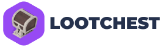

<!-- Improved compatibility of back to top link: See: https://github.com/othneildrew/Best-README-Template/pull/73 -->
<a name="readme-top"></a>
<!--
*** Thanks for checking out the Best-README-Template. If you have a suggestion
*** that would make this better, please fork the repo and create a pull request
*** or simply open an issue with the tag "enhancement".
*** Don't forget to give the project a star!
*** Thanks again! Now go create something AMAZING! :D
-->


<!-- PROJECT SHIELDS -->
<!--
*** I'm using markdown "reference style" links for readability.
*** Reference links are enclosed in brackets [ ] instead of parentheses ( ).
*** See the bottom of this document for the declaration of the reference variables
*** for contributors-url, forks-url, etc. This is an optional, concise syntax you may use.
*** https://www.markdownguide.org/basic-syntax/#reference-style-links
-->

[![LinkedIn][linkedin-shield]][linkedin-url]


<!-- PROJECT LOGO -->
<br />
<div align="center">
  <a href="https://github.com/othneildrew/Best-README-Template">
    
  </a>

  <p align="center">
    A unique chest opening platform
    <br />
    <br />
    <a href="https://lootchest.lol/">View Site</a>
    ·
    <a href="https://github.com/vinnyhoward/loot-chest/issues">Report Bug</a>
    ·
    <a href="https://github.com/vinnyhoward/loot-chest/issues">Request Feature</a>
  </p>
</div>


<!-- TABLE OF CONTENTS -->
<details>
  <summary>Table of Contents</summary>
  <ol>
    <li>
      <a href="#about-the-project">About The Project</a>
      <ul>
        <li><a href="#built-with">Built With</a></li>
      </ul>
    </li>
    <li>
      <a href="#getting-started">Getting Started</a>
      <ul>
        <li><a href="#prerequisites">Prerequisites</a></li>
        <li><a href="#installation">Installation</a></li>
      </ul>
    </li>
    <li><a href="#usage">Usage</a></li>
    <li><a href="#roadmap">Roadmap</a></li>
    <li><a href="#license">License</a></li>
    <li><a href="#contact">Contact</a></li>
    <li><a href="#acknowledgments">Acknowledgments</a></li>
  </ol>
</details>

## About The Project

[![Product Name Screen Shot][product-screenshot]](/public/images/product_image.png)

This project introduces a unique web-based 3D chest-opening experience, designed to captivate users with interactive visualizations and dynamic content. It stands out by providing a seamless and engaging exploration of virtual treasures, continuously evolving through updates in content management.

Key Highlights:
* **3D Visualization:** Engage users with captivating 3D graphics powered by Three.js.
* **Dynamic Content:** Easily updateable content via Sanity.io, keeping the experience fresh.
* **Efficient Development:** Built with TypeScript and optimized with Vite and Bun.js for a seamless development process.

### Built With

The development of this project is supported by a selection of modern technologies chosen for their performance, efficiency, and capability to enhance the 3D web experience:

* [![Typescript][Typescript]][ts-url] - Ensures code reliability and developer productivity through strong typing.

* [![Vite][Vite.js]][vite-url] - Offers fast build times and hot module replacement for efficient development.

* [![Three.js][Three.js]][three-url] - Powers the 3D graphics, bringing the virtual chest-opening sequences to life.

* [![Bun.js][Bun.js]][bun-url] - Delivers exceptional runtime performance, optimizing the web experience.

* [![Sanity.io][Sanity.io]][sanity-url] - Provides a scalable CMS for dynamic and flexible content updates.

Focused on the fusion of technology and creativity, this project demonstrates what's possible when innovative web development practices are applied to interactive 3D experiences.

<p align="right">(<a href="#readme-top">back to top</a>)</p>


## Getting Started

To set up this project locally and explore the immersive 3D chest-opening experience, follow these steps.

### Prerequisites

Ensure you have either Node.js or Bun installed on your system to manage project dependencies and run the development server.

- For Node.js, download and install it from [nodejs.org](https://nodejs.org/).
- For Bun, you can install it by running the following in your terminal (visit [bun.sh](https://bun.sh/) for more details):

```sh
curl https://bun.sh/install | bash
```

## Installation

1. Clone the repository to get a local copy of the project:

```sh
git clone https://github.com/your_username/loot-chest.git
cd loot-chest
```

<p align="right">(<a href="#readme-top">back to top</a>)</p>


2. Install dependencies using either npm (Node.js) or Bun. Choose the command based on your preference:

Using npm:

```sh
npm install
```

Using Bun:

```sh
bun install
```

3. Configure environment variables by creating a .env file in the root directory of the project. Fill it with your specific values based on the provided .env template:

```makefile
Copy code
PORT=3000
VITE_API_URL=<your_api_url>

VITE_SANITY_PROJECT_ID=<your_sanity_project_id>
VITE_SANITY_DATASET=<your_sanity_dataset>
```

Set up your environment variables: Rename the .env.example file to .env and update it with your specifics.

- PORT: The port your local server will run on (e.g., 3000).

- VITE_API_URL: Your backend API URL. Replace <your_api_url> with the actual API URL.

- VITE_SANITY_PROJECT_ID and VITE_SANITY_DATASET: Replace <your_sanity_project_id> and <your_sanity_dataset> with your Sanity project ID and dataset name. These are necessary for connecting to Sanity.io.

Visit the [backend repository](https://github.com/vinnyhoward/loot-chest-backend) for instructions on setting up your <your_api_url>.

Visit the [cms repository](https://github.com/vinnyhoward/loot-chest-cms) for instructions on setting up your Sanity environment started.


4. Run the development server to start the project locally. Use the corresponding command for your chosen package manager:

Using npm:

```sh
npm run dev
```

Using Bun:

```sh
bun run dev
```

Access the application by navigating to http://localhost:5173/ in your web browser (or another port if you specified a different one in your .env file).

Now, you're ready to dive into the project and start exploring the 3D chest-opening experience!

<p align="right">(<a href="#readme-top">back to top</a>)</p>


## Usage

WIP

<p align="right">(<a href="#readme-top">back to top</a>)</p>

## Roadmap

- [ ] Add onboarding modal
- [ ] Roulette chest opening experience
- [ ] Forgot Password/Reset Password  needs a expired token flow
- [ ] Welcome to Loot Chest email

<p align="right">(<a href="#readme-top">back to top</a>)</p>

## License

Distributed under the MIT License. See `LICENSE.txt` for more information.

<p align="right">(<a href="#readme-top">back to top</a>)</p>


## Contact

Vincent Howard - [@NiftyDeveloper](https://twitter.com/NiftyDeveloper) - vincenguyenhoward@gmail.com

Project Link: [https://github.com/vinnyhoward/loot-chest](https://github.com/vinnyhoward/loot-chest)

<p align="right">(<a href="#readme-top">back to top</a>)</p>

## Acknowledgments

WIP

* [Choose an Open Source License](https://choosealicense.com)


<p align="right">(<a href="#readme-top">back to top</a>)</p>

<!-- https://www.markdownguide.org/basic-syntax/#reference-style-links -->
[contributors-shield]: https://img.shields.io/github/contributors/othneildrew/Best-README-Template.svg?style=for-the-badge
[contributors-url]: https://github.com/othneildrew/Best-README-Template/graphs/contributors
[forks-shield]: https://img.shields.io/github/forks/othneildrew/Best-README-Template.svg?style=for-the-badge
[forks-url]: https://github.com/othneildrew/Best-README-Template/network/members
[stars-shield]: https://img.shields.io/github/stars/othneildrew/Best-README-Template.svg?style=for-the-badge
[stars-url]: https://github.com/othneildrew/Best-README-Template/stargazers
[issues-shield]: https://img.shields.io/github/issues/othneildrew/Best-README-Template.svg?style=for-the-badge
[issues-url]: https://github.com/othneildrew/Best-README-Template/issues
[license-shield]: https://img.shields.io/github/license/othneildrew/Best-README-Template.svg?style=for-the-badge
[license-url]: https://github.com/othneildrew/Best-README-Template/blob/master/LICENSE.txt
[linkedin-shield]: https://img.shields.io/badge/-LinkedIn-black.svg?style=for-the-badge&logo=linkedin&colorB=555
[linkedin-url]: https://linkedin.com/in/othneildrew
[product-screenshot]: public/images/product_image.png
[Next.js]: https://img.shields.io/badge/next.js-000000?style=for-the-badge&logo=nextdotjs&logoColor=white
[Next-url]: https://nextjs.org/
[React.js]: https://img.shields.io/badge/React-20232A?style=for-the-badge&logo=react&logoColor=61DAFB
[React-url]: https://reactjs.org/
[Vue.js]: https://img.shields.io/badge/Vue.js-35495E?style=for-the-badge&logo=vuedotjs&logoColor=4FC08D
[Vue-url]: https://vuejs.org/
[Angular.io]: https://img.shields.io/badge/Angular-DD0031?style=for-the-badge&logo=angular&logoColor=white
[Angular-url]: https://angular.io/
[Svelte.dev]: https://img.shields.io/badge/Svelte-4A4A55?style=for-the-badge&logo=svelte&logoColor=FF3E00
[Svelte-url]: https://svelte.dev/
[Laravel.com]: https://img.shields.io/badge/Laravel-FF2D20?style=for-the-badge&logo=laravel&logoColor=white
[Laravel-url]: https://laravel.com
[Bootstrap.com]: https://img.shields.io/badge/Bootstrap-563D7C?style=for-the-badge&logo=bootstrap&logoColor=white
[Bootstrap-url]: https://getbootstrap.com
[JQuery.com]: https://img.shields.io/badge/jQuery-0769AD?style=for-the-badge&logo=jquery&logoColor=white
[JQuery-url]: https://jquery.com 
[Vite.js]: https://img.shields.io/badge/vite-%23646CFF.svg?style=for-the-badge&logo=vite&logoColor=white
[vite-url ]: https://vitejs.dev/
[Typescript]: https://img.shields.io/badge/typescript-%23007ACC.svg?style=for-the-badge&logo=typescript&logoColor=white
[ts-url ]: https://www.typescriptlang.org/
[Three.js]: https://img.shields.io/badge/threejs-black?style=for-the-badge&logo=three.js&logoColor=white
[three-url]: https://threejs.org/
[bun-url]: https://bun.sh/
[Bun.js]: https://img.shields.io/badge/bun-282a36?style=for-the-badge&logo=bun&logoColor=fbf0df
[Sanity.io]: https://img.shields.io/badge/Sanity.io-black?style=for-the-badge&logo=sanity&logoColor=white
[sanity-url]: https://www.sanity.io/